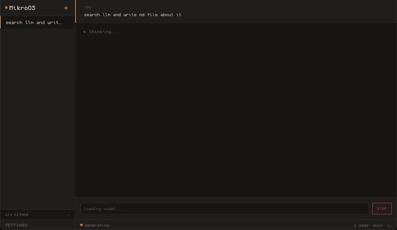

<div align="center">
  
  <h1>MikroOS</h1>
  <p><strong>Browser-native AI coding agent.</strong><br/>
  A local LLM, a Linux-like sandbox and a real terminal — all running inside a single browser tab.<br/>
  No server. No API keys. No network round-trips required.</p>

  <p>
    <a href="https://mikroos.com"></a>
    
    
    
  </p>

  <p><a href="https://mikroos.com"><strong>mikroos.com</strong></a></p>

  <br/>
  
</div>

---

## What is this?

MikroOS is a self-contained coding agent that lives in your browser. It streams a local LLM, executes shell commands in a virtual Unix sandbox, edits files, searches the web and previews HTML — without touching a remote API.

- **Local-first by design.** Models, files, threads, and chat history never leave the tab. Everything is stored in IndexedDB / localStorage.
- **Dual LLM runtime.** Runs [WebLLM](https://github.com/mlc-ai/web-llm) (Qwen via WebGPU) or [🤗 Transformers.js](https://github.com/huggingface/transformers.js) (Bonsai ONNX, with WebGPU → WASM fallback).
- **Real sandbox.** Powered by [`@lifo-sh/core`](https://www.npmjs.com/package/@lifo-sh/core) — a virtual OS with bash, a filesystem, `grep`, `sed`, `awk`, `tar`, `nano`, and a package manager (`lifo install`).
- **Pixel UI.** 8-bit / PICO-8 inspired — pixel font, zero border-radius, warm dark palette with a single amber accent.

---

## Quickstart

```bash
git clone https://github.com/kubet/mikroos
cd mikroos
npm install
npm run dev
```

Open <http://localhost:5173>, complete the 2-step setup (intro → model picker, **Qwen3 4B** is recommended), and start chatting.

> **Browser support.** Qwen models require WebGPU (Chrome 113+, Edge 113+, Safari 17.4+). The Bonsai 1.7B model falls back to WASM and runs everywhere.

---

## Architecture

```
src/
├─ engine/          # headless core — no DOM
│  ├─ agent.ts         tool-calling loop + sub-agent delegation
│  ├─ orchestrator.ts  "autowork" mode — verifies files got written
│  ├─ llm.ts           engine facade (worker / Safari main-thread)
│  ├─ llm-worker.ts    WebGPU loader with WASM fallback
│  ├─ models.ts        5 model presets (Bonsai + Qwen 0.6/1.7/4/8B)
│  ├─ tools.ts         9 tools the LLM can call
│  ├─ skills.ts        6 curated project templates
│  ├─ sandbox.ts       @lifo-sh virtual OS wrapper
│  ├─ store.ts         Solid.js reactive state + localStorage
│  └─ todos.ts         in-memory todo list
└─ ui/              # Solid components
   ├─ App.tsx
   └─ components/
      ├─ Chat.tsx         streaming message view + input
      ├─ MessageView.tsx  markdown rendering + HTML previews
      ├─ Sidebar.tsx      threads, settings, github banner
      ├─ Setup.tsx        first-run onboarding modal
      ├─ StatusBar.tsx    LLM status · autowork · terminal toggle
      └─ Terminal.tsx     xterm bound to the sandbox shell
```

### Model options

| Model       | Size     | Runtime       | Requires |
|-------------|---------:|---------------|----------|
| Bonsai 1.7B | ~277 MB  | Transformers (ONNX) | WebGPU or WASM |
| Qwen3 0.6B  | ~1.4 GB  | WebLLM        | WebGPU   |
| Qwen3 1.7B  | ~2 GB    | WebLLM        | WebGPU   |
| **Qwen3 4B** | ~3.4 GB | WebLLM        | WebGPU   |
| Qwen3 8B    | ~5.7 GB  | WebLLM        | WebGPU   |

Model weights are downloaded once on first use and cached by the browser; subsequent launches are instant.

### Tools the agent has access to

| Tool       | Params                       | Description |
|------------|------------------------------|-------------|
| `bash`     | `command`                    | run a shell command in `/workspace` |
| `read`     | `path`                       | read a file |
| `write`    | `path, content`              | write a file (creates parent dirs) |
| `edit`     | `path, old_string, new_string` | find-and-replace in a file |
| `grep`     | `pattern, path`              | recursive content search |
| `search`   | `query`                      | hybrid skill search + Google (via CORS proxy) |
| `open`     | `target`                     | open a skill or fetch a URL (readability-extracted) |
| `preview`  | `path`                       | render an HTML file in a sandboxed iframe |
| `todo`     | `action, text`               | add / done / list |
| `delegate` | `task`                       | spawn a fresh sub-agent with a scoped goal |

### Skills

Curated project templates the agent can `search` and `open`: **react**, **vue**, **site** (offline HTML), **presentation** (HTML slides), **api** (Node REST), **script** (shell).

### Autowork mode

Toggle `auto` in the status bar to route requests through the **orchestrator** (`src/engine/orchestrator.ts`) instead of the raw agent. It runs the agent, then scans `/workspace` for new files and nudges the agent again if nothing was written. Reports the final file count on completion.

---

## Offline behaviour

The agent inspects `navigator.onLine` at each turn and adapts its system prompt:

- **Online** — CDN imports (unpkg / esm.sh) are allowed, `search` and `open` can hit the web through two CORS proxies (`codetabs`, `allorigins`).
- **Offline** — the agent is instructed to write fully self-contained HTML (inline CSS/JS), no CDN, no web calls.

No authentication, no API keys, no telemetry. Ever.

---

## Scripts

```bash
npm run dev        # start Vite dev server (http://localhost:5173)
npm run host       # same, exposed on LAN
npm run build      # tsc + vite build → ./dist
npm run preview    # serve the built bundle
npm test           # vitest (unit)
npm run test:e2e   # playwright (UI)
npm run test:all   # both
```

---

## Project status

This is a **working prototype**, not production software.

**What works:** tool-calling loop with retry, WebGPU→WASM fallback, persistent threads, sandbox commands, HTML preview, streaming UI with stop/abort, first-run onboarding, autowork mode.

**Rough edges:**
- Tool-call JSON is parsed with a regex — malformed calls trigger a retry, but deeply nested arguments can still trip it up.
- On Safari, WebLLM runs on the main thread (workers have no WebGPU there), so the UI briefly blocks during generation.
- Web search piggybacks on public CORS proxies; if both fail, the agent falls back to skill-only results.
- The agent loop is hard-capped at 15 iterations per turn.

PRs welcome. Keep the pixel aesthetic. Keep it local.

---

## License

MIT — see [LICENSE](LICENSE).
